# АНАЛИЗ ДАННЫХ И ИСКУССТВЕННЫЙ ИНТЕЛЛЕКТ [in GameDev]
Отчет по лабораторной работе #4 выполнил(а):
- Шмаков Данил Юрьевич
- РИ210911
Отметка о выполнении заданий (заполняется студентом):

| Задание | Выполнение | Баллы |
| ------ | ------ | ------ |
| Задание 1 | * | 60 |
| Задание 2 | * | 20 |
| Задание 3 | * | 20 |

знак "*" - задание выполнено; знак "#" - задание не выполнено;

Работу проверили:
- к.т.н., доцент Денисов Д.В.
- к.э.н., доцент Панов М.А.
- ст. преп., Фадеев В.О.

Структура отчета

- Данные о работе: название работы, фио, группа, выполненные задания.
- Цель работы.
- Задание 1.
- Код реализации выполнения задания. Визуализация результатов выполнения (если применимо).
- Задание 2.
- Код реализации выполнения задания. Визуализация результатов выполнения (если применимо).
- Задание 3.
- Код реализации выполнения задания. Визуализация результатов выполнения (если применимо).
- Выводы.

## Цель работы
Ознакомиться с основными операторами зыка Python на примере реализации линейной регрессии.

## Задание 1
### В проекте Unity реализовать перцептрон, который умеет производить вычисления логических функций
- Создаём пустой проект Unity
- Создаём на сцене пустой GameObject и прикрепляем к нему файл(Perceptron.cs)
- Настраиваем входные данные для обучения перцептрона имитации логических функций OR, AND, NAND, XOR
#### OR
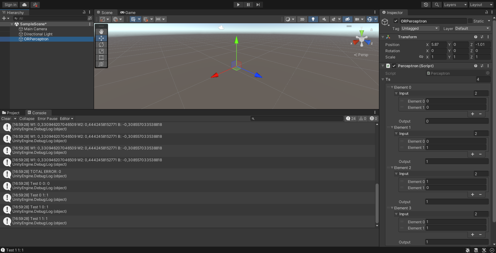
- Обучение прошло успешно, т.к. общая ошибка уменьшилась

#### AND
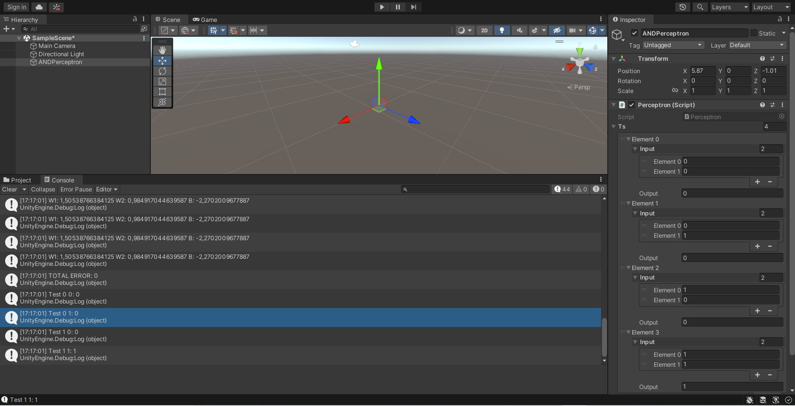
- Обучение прошло успешно, т.к. общая ошибка уменьшилась

#### NAND
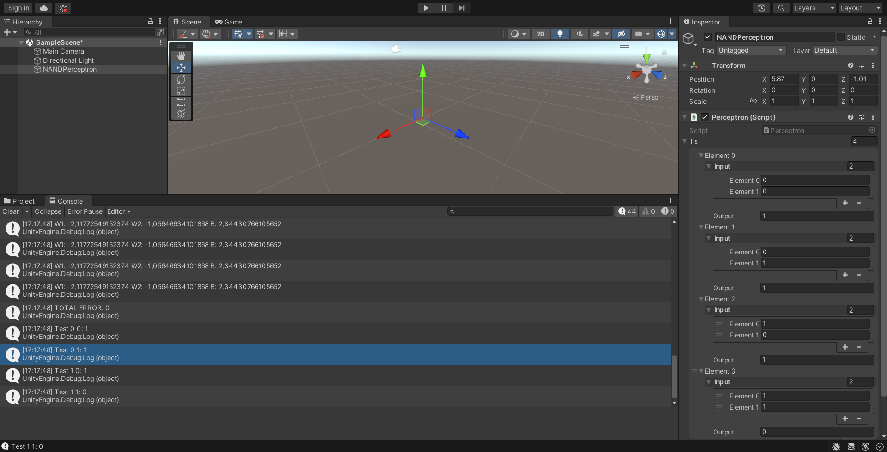
- Обучение прошло успешно, т.к. общая ошибка уменьшилась

#### XOR
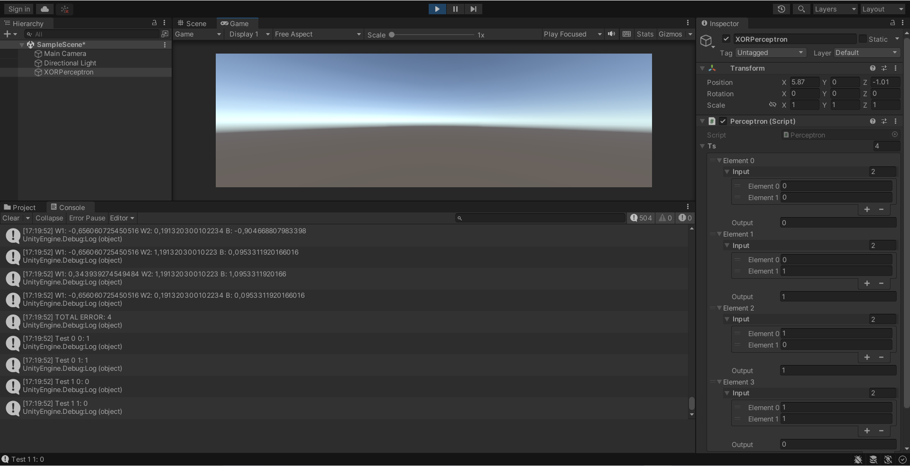

- Проанализировав ситуацию заметим, что у перцептрона не уменьшается ошибка, что подтверждает факт того, что перцептрон нельзя обучить имитировать XOR(Minsky xor problem)

## Задание 2
### Построить графики зависимости ошибки от количества эпох обучения
- Получим зависимость ошибки от количества эпох в течении 9 эпох

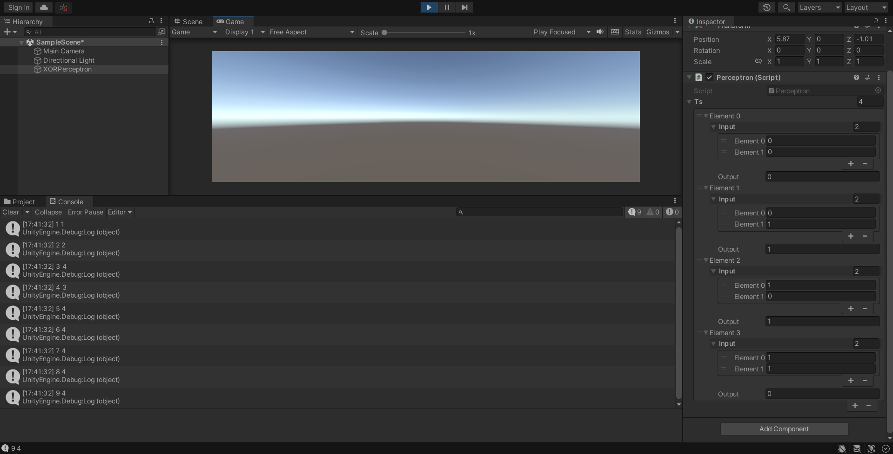

-Построим графики

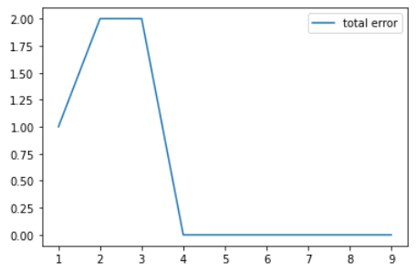

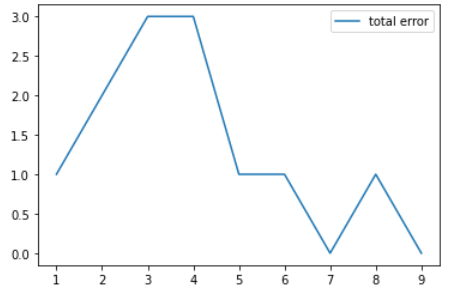

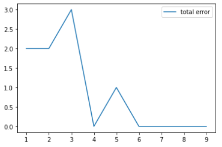

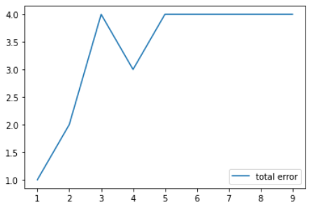

## Задание 3
### Построить визуальную модель работы перцептрона на сцене Unity

Создадим:
- OrPerceptron
- Плоскость
- Два куба OneCube с компонентом Rigidbody
- Два куба Pedestal с компонентом Script(Pedestal.cs)
- Куб ResultCube с компонентом Script(ResultCube.cs)

Логика взаимодействия:
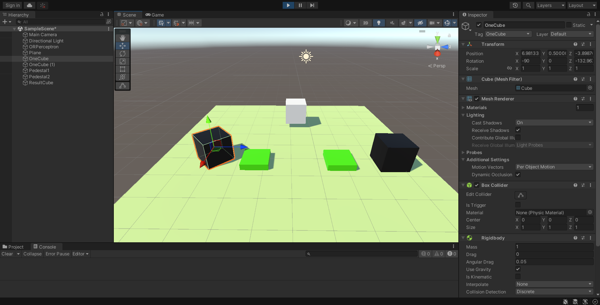
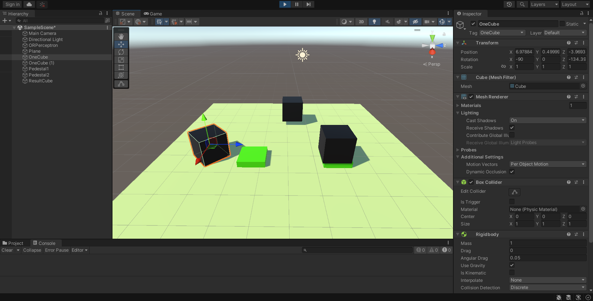
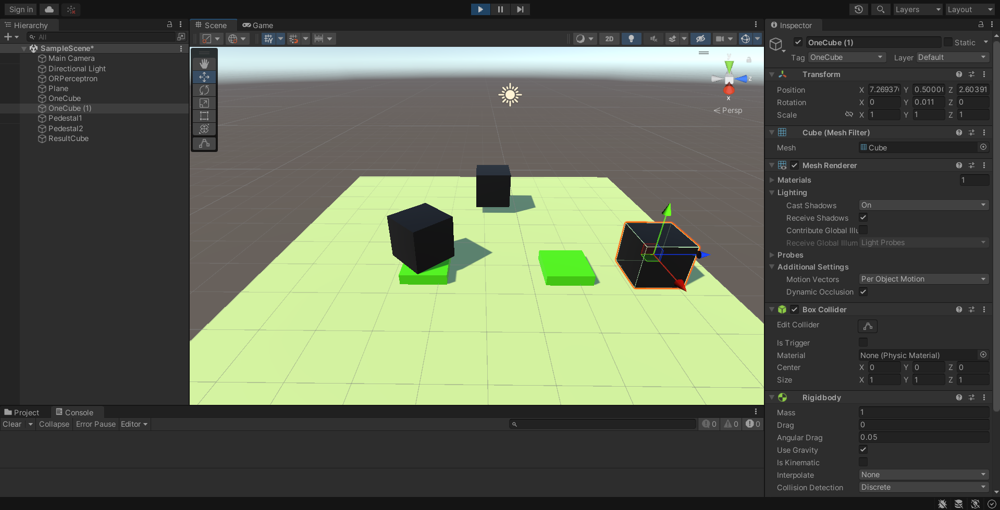
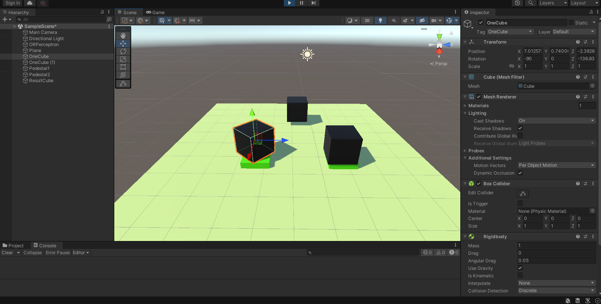

## Выводы

- Обучили перцептрон имитировать логические функции
- Обнаружили задачу, не решаемую перцептроном
- Изучили зависимость ошибки от эпох обучения
- Построили визуальную модель работы перцептрона

| Plugin | README |
| ------ | ------ |
| Dropbox | [plugins/dropbox/README.md][PlDb] |
| GitHub | [plugins/github/README.md][PlGh] |
| Google Drive | [plugins/googledrive/README.md][PlGd] |
| OneDrive | [plugins/onedrive/README.md][PlOd] |
| Medium | [plugins/medium/README.md][PlMe] |
| Google Analytics | [plugins/googleanalytics/README.md][PlGa] |

## Powered by

**BigDigital Team: Denisov | Fadeev | Panov**